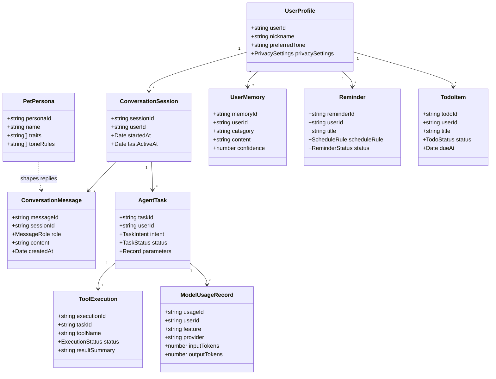
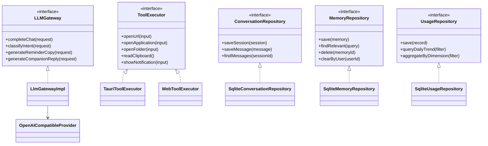
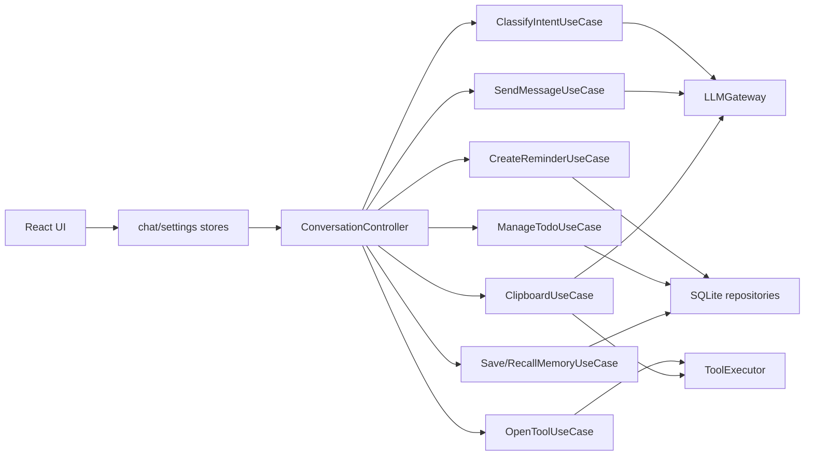

# 领域模型与类图

## 1. 核心实体

| 实体 | 责任 | 关键字段 |
| --- | --- | --- |
| `UserProfile` | 用户基础资料和偏好 | `userId`、`nickname`、`privacySettings` |
| `PetPersona` | 桌宠人格和语气规则 | `personaId`、`name`、`traits`、`toneRules` |
| `ConversationSession` | 一次会话上下文 | `sessionId`、`userId`、`startedAt`、`lastActiveAt` |
| `ConversationMessage` | 用户/助手消息 | `messageId`、`sessionId`、`role`、`content` |
| `AgentTask` | 可追踪任务单元 | `taskId`、`intent`、`status`、`parameters` |
| `ToolExecution` | 具体工具调用记录 | `executionId`、`taskId`、`toolName`、`status` |
| `Reminder` | 提醒任务 | `reminderId`、`scheduleRule`、`status` |
| `TodoItem` | 待办事项 | `todoId`、`title`、`status`、`dueAt` |
| `UserMemory` | 显式长期记忆 | `memoryId`、`category`、`content`、`confidence` |
| `ModelUsageRecord` | 模型调用和 Token 统计 | `usageId`、`feature`、`provider`、`tokens` |

## 2. 领域类图

## 3. 端口与实现类图

## 4. 用例依赖图

## 5. 建模注意事项

- `AgentTask` 是任务可观测性的中心，后续应补齐任务表或任务日志。
- `ToolExecution` 不等同于 `AgentTask`，一个任务可以包含多次工具调用。
- `UserMemory` 只保存显式记忆，不应由聊天历史自动无限写入。
- `ModelUsageRecord` 应覆盖聊天、意图识别、提醒文案、剪贴板处理等所有模型调用。

