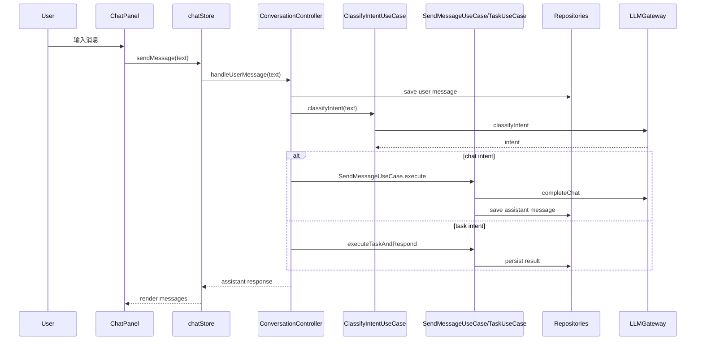
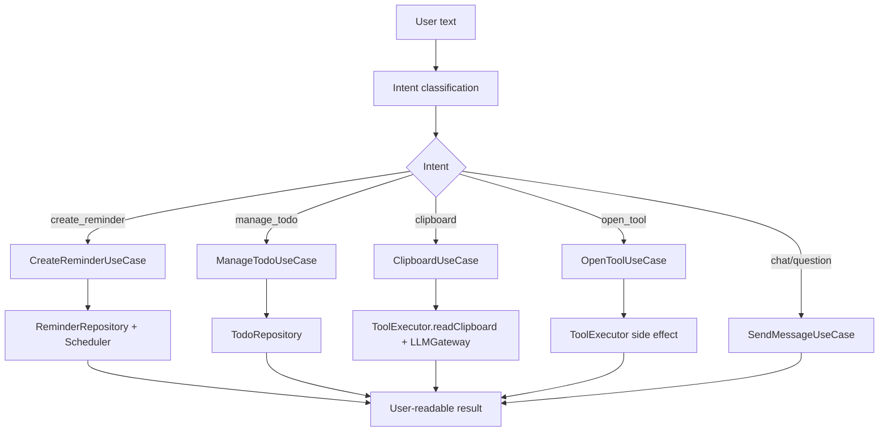
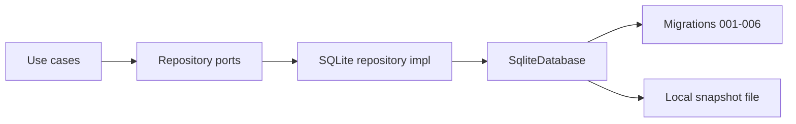

# 运行流程与接口

## 1. 对话主链路

## 2. 任务执行流程

## 3. 平台能力接口

| 能力 | 前端端口 | Tauri 插件/实现 | 回退策略 |
| --- | --- | --- | --- |
| 打开 URL | `ToolExecutor.openUrl` | `plugin-shell` | `window.open` |
| 打开应用 | `ToolExecutor.openApplication` | `plugin-shell` | 返回不可用说明 |
| 打开文件夹 | `ToolExecutor.openFolder` | `plugin-shell` | 返回不可用说明 |
| 读写剪贴板 | `ToolExecutor.readClipboard/writeClipboard` | `plugin-clipboard-manager` | Web Clipboard API 或友好失败 |
| 通知 | `ToolExecutor.showNotification` | `plugin-notification` | 面板内提示 |
| 全局快捷键 | `setupChatShortcut` | `plugin-global-shortcut` | Web keydown fallback |
| 开机启动 | `system-preferences` | `plugin-autostart` | 设置项显示不可用 |

## 4. 数据持久化流程

当前迁移范围：

- `001-conversations.ts`：会话与消息。
- `002-reminders.ts`：提醒。
- `003-todos.ts`：待办。
- `004-settings.ts`：设置。
- `005-memories.ts`：用户记忆。
- `006-usage.ts`：模型用量。

## 5. 错误处理约定

- Domain/Application 抛出领域错误或返回结构化失败结果。
- Infrastructure 将 SDK/Tauri/SQLite 错误包装为项目错误类型。
- Controller 负责映射为用户可读文案。
- 工具调用失败不应破坏后续对话。
- 权限不可用要明确提示能力不可用，而不是静默失败。

## 6. LLM 调用约定

每次调用必须尽量包含：

- `feature`：如 `chat`、`intent_classification`、`clipboard_summary`。
- `sessionId`：对话相关调用必填。
- `taskId`：任务相关调用必填或在执行时生成。
- `provider`、`model`、`latencyMs`、`status`、token 统计。

## 7. 当前运行注意事项

- Windows 当前更适合使用 `npm run tauri:dev:gnu`。
- 若 `tauri:check:gnu` 报 `os error 32`，优先检查是否仍有 `app.exe`、`cargo.exe`、`node.exe` 残留。
- `global-shortcut` 重复注册通常来自旧进程未退出或热键未释放。

## 8. TEST009 GUI 验收入口映射

TEST009 GUI 终验以 `docs/06-验收与质量门禁.md` 为执行手册，本节只维护运行入口和能力映射，避免验收时偏离实际 UI。

| GUI 入口 | 代码入口 | 主链路 | 验收关注点 |
| --- | --- | --- | --- |
| 桌宠主体 | `src/ui/desktop-pet/PetShell.tsx` | 点击桌宠打开聊天面板；根据 `isTyping`、消息和空闲时间切换动效 | idle/thinking/happy/reminding 状态必须可观察 |
| 聊天面板 | `src/ui/chat-panel/ChatPanel.tsx` | 面板包含消息列表、QuickActions、输入框、设置按钮 | 打开/关闭、点击外部关闭、消息渲染 |
| 消息输入 | `src/ui/chat-panel/MessageInput.tsx` | Enter 或发送按钮调用 `chatStore.sendMessage` | 用户消息、typing、助手回复 |
| QuickActions | `src/ui/chat-panel/QuickActions.tsx` | 预设文本调用 `sendMessage(presetText)` | 提醒、待办、剪贴板入口必须进入 Controller，而不是只追加本地消息 |
| 设置面板 | `src/ui/settings/SettingsPanel.tsx` | 加载设置、模型配置、用量；保存到 settings repository | 通知、提醒、自启动、模型配置保存和失败回退 |
| Tauri 权限 | `src-tauri/capabilities/default.json` | shell、notification、global-shortcut、clipboard-manager、autostart | 缺权限或平台不可用时给出可理解反馈 |

推荐执行顺序：

1. `npm run smoke:check`
2. `node scripts/gui-acceptance-check.mjs`
3. `npm run tauri:dev:gnu`
4. 按 `docs/06-验收与质量门禁.md` 的 TEST009 流程归档证据。
